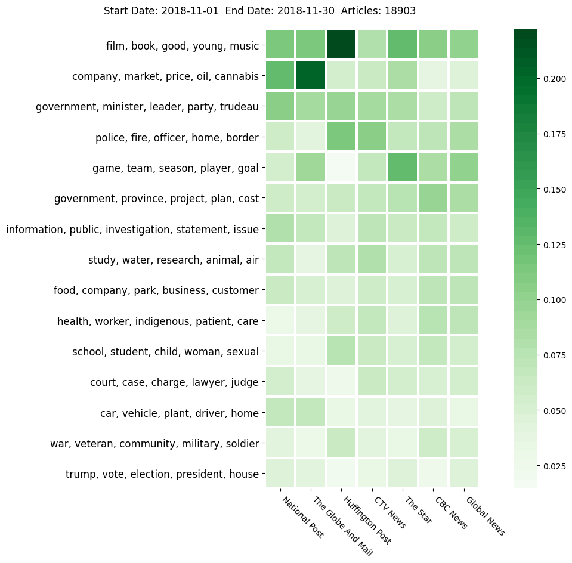

# Topic Modelling
The idea in this section is to use PySpark to perform large-scale topic modelling on the news text using the Latent Dirichlet Allocation (LDA) method. LDA is a probabilistic (Bayesian) method that looks at word occurrences both *within* a document and *across* documents in a corpus, so it is expected to perform better with richer text content, i.e. using the entire article body rather than just the extracted quotes. Because it uses a bag-of-words approach, it should also scale to a large fraction of the full data as it grows with time. Two options for running LDA topic model on the GGT data are described below.

## Option 1. Directly interface with the database

The production version of the topic model training script runs monthly on a dedicated VM (which we call the topic VM), whose details are described in this section. This script is designed to run in as automated a fashion as possible - the amount of human interaction required is minimized so that the only step where a human comes in is the final one, when the topics need to be manually labelled.

### Data
The production topic model script (`train.py`) runs monthly, i.e. it automatically runs just once at the start of every month using a cronjob, on the *previous* month's articles from just the English outlets in our dataset. To avoid any human interaction in this step, the script directly pulls the relevant data from the database for the previous month (calculated programmatically based on the timestamp at the start of the script's execution).

The data for the given month is queried using `pymongo`, which sets up a connection to the database, reads in articles within the start/end date of the previous month and returns just the relevant fields or topic modelling as a list of objects. This list is then converted to a Spark DataFrame, following which it can be worked with in a distributed fashion for topic modelling.

#### Filtering criteria
We only perform topic modelling on English language articles at present (In the future, French language topic modelling is possible using the data we have already collected). Till February 2021, we were obtaining articles from seven Canadian English language outlets. **Starting March 2021, HuffPost Canada was dissolved as an organization and we now only scrape articles from the other six outlets**.

```py
['National Post', 'The Globe And Mail', 'The Star', 'Huffington Post',
 'Global News', 'CTV News', 'CBC News']
```

#### Note on data size
Because the data being passed from `pymongo` across the network is in the form of a list, there are finite restrictions on how large the dataset can be using this production script. It is recommended to **limit the time period of data being worked on to no more than one month** to avoid memory issues on the production VM.

### Output
The production script `train.py` directly writes the results in the form of JSON objects to a new collection `topicModel` directly to MongoDB. This avoids having to maintain messy, external files containing results and allows us to continuously log each month's results in an organized, scalable manner.

### Usage
The begin/end dates for the last month are automatically calculated using Python's `datetime` module. A required input argument to Spark is the version of the Spark NLP library, used for lemmatization, so this is specified with the `spark-submit` command as shown below.

Note that from February 2021 onwards, we have 24 GB of memory available on the topic VM instance that runs the topic model in production. As a result, we can afford to increase the allocated driver memory to **7 GB** rather than the default 1 GB. Also, we specify 4 executors, with 4 GB of memory each. The full command used to run the topic model in production is below.

```sh
spark-submit --packages com.johnsnowlabs.nlp:spark-nlp_2.11:2.4.5 \
    --driver-memory 7G \
    --executor-memory 4G \
    --num-executors 4 \
    train.py \
    --partitions 200
```

Display all the optional arguments for topic model training as follows.
```
spark-submit --packages com.johnsnowlabs.nlp:spark-nlp_2.11:2.4.5 train.py --help

optional arguments:
  -h, --help            show this help message and exit
  --topics TOPICS       Number of topics for LDA
  --iter ITER           Max. LDA iterations
  --vocab VOCAB         Max. LDA vocabSize
  --minDF MINDF         Min. term document frequency
  --maxDF MAXDF         Max. term document frequency
  --partitions PARTITIONS
                        Number of shuffle partitions in PySpark
  --begin_date BEGIN_DATE
                        Begin date in YYYY-mm-dd format
  --end_date END_DATE   End date in YYYY-mm-dd format
  --gender_delta GENDER_DELTA
                        Define delta for male/female source-dominant articles
  --save_model          Save topic model trained on the given time-range's
                        data
```

---

## Option 2. Run using parquet files on Compute Canada
Alternately, for experimentation on large data sizes or for testing new functionality, a standalone topic model script (`train_cc.py`) is provided, that runs on Compute Canada resources. Unlike the production version, this process is designed to be customizable, both in terms of data content/size, as well as the individual functions implemented. The below sections pertain only to the files `preproc_cc.py` and `train_cc.py` (Compute Canada).

Because Compute Canada's cluster has much more resources, it is possible to train topic models on **much more data** over much longer periods of time (1-1.5 years). To avoid memory constraints during data transfer, the standalone version of the topic model trainer runs on a static data dump (in parquet format). This allows us to work with arbitrarily large time periods with almost unbounded amounts of data during training -- all we would do is scale up the compute requirements as more data is being worked on.

### 2a. MongoDB raw data dump
The entire MongoDB Database's content is output to a distributed file system in **parquet** format. This step can be performed periodically as and when updates to the topic model are required. To handle the extremely large amount of data imported and exported from the system, the Spark-MongoDB connector is used.

### 2b. Clean and filter data
The raw data from the initial dump is not structured enough to convert to a PySpark DataFrame. It also contains a lot of unnecessary information (stored as deeply nested JSON) which is not relevant to topic modelling. To prepare it for analysis, the script `preproc_cc.py` is run to extract the relevant parts to a PySpark DataFrame and output it to a *separate* clean, structured parquet file.

#### Usage
**This file is run just once** each time a new MongoDB data dump is obtained.

#### Arguments

```sh
spark-submit --driver-memory 16G \
             --num-executors 16 \
             --executor-cores 4 \
             --executor-memory 16G \
             preproc_cc.py \
             --partitions 100   # Number of shuffle partitions PySpark
```

#### Filtering criteria - *English only*
Since topic modelling is language-specific, the first step is to filter only the articles specific to that language. Till February 2021, we were obtaining articles from seven English language outlets. **Starting March 2021, HuffPost Canada was dissolved as an organization and we now only scrape articles from the other six outlets**.

```py
['National Post', 'The Globe And Mail', 'The Star', 'Huffington Post',
 'Global News', 'CTV News', 'CBC News']
```

#### Valid date range
The data dump on Compute Canada that we used during the experimentation phase consisted of all English language articles between **October 1, 2018** and **April 20, 2020**, stored in parquet format.

#### Articles containing non-null sources
Any article on which the NLP quote extraction pipeline was successful run must contain non-null values for the `sourcesFemaleCount` and `sourcesMaleCount` fields. If they are null, then there could be a more serious issue with the article's text, hence this filtering step is applied as a failsafe to prevent invalid text from being fed to the topic modelling pipeline.

The below columns and data types are returned after the filtering steps:

```py
[('id', 'string'),
 ('timestamp', 'timestamp'),
 ('outlet', 'string'),
 ('title', 'string'),
 ('body', 'string'),
 ('peopleFemaleCount', 'int'),
 ('peopleMaleCount', 'int'),
 ('sourcesFemaleCount', 'int'),
 ('sourcesMaleCount', 'int')]
```

#### Filtered result
There exist roughly **457,000** English news articles published between the dates October 1, 2018 and April 20, 2020. This data is output once again in parquet format (to a separate directory).

### 2c. Train topic model
Topic modelling is an experimental process that requires careful parameter and stopword tuning. To effectively run experiments, the topic modelling script allows the user to specify a date-range to run the model on a subset of the full data.

#### Usage
To train an LDA topic model on the filtered data for articles in the period **November 1, 2019** and **January 31, 2020**, use the below command.

```sh
spark-submit --packages com.johnsnowlabs.nlp:spark-nlp_2.11:2.4.0 \
    --driver-memory 16G \
    --executor-memory 16G \
    --num-executors 16 \
    --executor-cores 4 \
    train_cc.py \
    --topics 15 \
    --iter 100 \
    --vocab 5000 \
    --minDF 0.02 \
    --maxDF 0.8 \
    --partitions 200 \
    --begin_date 2019-11-01 \
    --end_date 2020-01-31
```

#### Optional Python Arguments
Run the below command to see the optional Python arguments for the training script.

```
spark-submit --packages com.johnsnowlabs.nlp:spark-nlp_2.11:2.4.0 train_cc.py --help

optional arguments:
  -h, --help            show this help message and exit
  --topics TOPICS       Number of topics for LDA
  --iter ITER           Max. LDA iterations
  --vocab VOCAB         Max. LDA vocabSize
  --minDF MINDF         Min. term document frequency
  --maxDF MAXDF         Max. term document frequency
  --partitions PARTITIONS
                        Number of shuffle partitions in PySpark
  --begin_date BEGIN_DATE
                        Start date
  --end_date END_DATE   End date
  --gender_delta GENDER_DELTA
                        Define delta for male/female source-dominant articles
  --disable_outlet_log  Do not write log containing topic distribution per
                        outlet
  --disable_gender_log  Do not write log containing topic distribution per
                        gender
  --save_model          Save topic model trained on the given time-range's
                        data
```

#### Run using default arguments
It is recommended to run the topic model training script using the default values for all the arguments **except** the start and end dates:

```sh
spark-submit --packages com.johnsnowlabs.nlp:spark-nlp_2.11:2.4.0 \
    --driver-memory 16G \
    --executor-memory 16G \
    --num-executors 16 \
    --executor-cores 4 \
    train_cc.py \
    --begin_date 2020-01-01 \
    --end_date 2020-01-31
```

To run the same case without writing out the mean topic distribution per outlet/gender, use the appropriate boolean arguments to disable them.

```sh
spark-submit --packages com.johnsnowlabs.nlp:spark-nlp_2.11:2.4.0 \
    --driver-memory 16G \
    --executor-memory 16G \
    --num-executors 16 \
    --executor-cores 4 \
    train_cc.py \
    --begin_date 2020-01-01 \
    --end_date 2020-01-31 \
    --disable_outlet_log \
    --disable_gender_log
```

_**NOTE**_: The topic log (containing topic words, weights and the model parameters used) is *always* written out, since this is the whole point of the training routine.

#### Scale to handle larger datasets
Increasing the number of partitions from 100 to 200 can help reduce the amount of data that each executor in Spark has to work with - however, this only works up to a certain point. Based on the experiments run for GGT, to run the topic model for data over a longer period's worth of data (1 to 1.5 years), we need to scale up the memory and number of executors to handle upwards of 400,000 news articles as per the below table. 

| Time-period | Article count (approx). | Driver memory | Executor memory | Number of executors | Executor cores | Partitions | Run time (approx.) |
| --- | ---: | ---: | ---: | ---: | ---: | ---: | ---: |
| 1 month | 25,000 | 8G | 2G | 4 | 2 | 100 | 2 mins |
| 3 months | 80,000 | 16G | 16G | 8 | 4 | 100 | 3 mins |
| 6 months | 160,000 | 16G | 16G | 16 | 4 | 150 | 5 mins |
| 1.5 years | 400,000 | 18G | 18G | 24 | 4 | 200 | 25 mins |

 **For the fastest results** over long time periods, maximize the number of executors (along with executor memory) as per the below table - this ensures less data needs to be passed back and forth between executors during run time and considerably speeds up the computation.

 | Time-period | Article count (approx). | Driver memory | Executor memory | Number of executors | Executor cores | Partitions | Run time (approx.) |
| --- | ---: | ---: | ---: | ---: | ---: | ---: | ---: |  
| 1.5 years | 400,000 | 20G | 20G | 32 | 4 | 200 | 12 mins |

#### Topic Results
Multiple structured log files in JSON format are output for each case run, with the start date prefixed to the filename:

* parameters used and the topic words/weights
* mean topic distribution per outlet
* mean topic distribution per gender
* mean topic distribution per outlet *and* gender

In addition, a **trained topic model** can be saved (optionally) with the date range suffixed to the directory name.

### 2d. Visualize Topics
The topic words and their associated weights from LDA are present in the topic word logfile. The model's parameters from the topic JSON file are also displayed as a table to make it clear which model the wordclouds are for.

```sh
                    value
iterations            150
minDF                0.02
begin_date     2018-11-01
num_topics             15
end_date       2018-11-30
articleCount        18903
vocabSize            5000
maxDF                 0.8
maxPerplexity     6.84526
```

An example wordcloud plot for 15 topics is shown below.


The mean topic distribution for each outlet is visualized as a heatmap using the data from the outlet logfile written by the topic modelling script. Looking at dense areas of the heatmap shows which particular topics were focused on more by specific publications in the given time period. An example heatmap is shown below.



In addition, we can also plot the discrepancy in topic strength depending on whether more women or men were quoted on average for a particular topic. This is also visualized using a heatmap, but with divergent colours as shown below. A redder colour indicates that a topic was more dominant when more women were quoted than men (on average), while a bluer colour indicates that a topic was more dominant when more men were quoted than women (on average).


### Installation
**This script requires a minimum of Python 3.6.** 

First, set up a virtual environment and install the modules in `requirements.txt`:

```sh
python3 -m venv venv
source venv/bin/activate
pip3 install -r requirements.txt
```

For further development, simply activate the existing virtual environment.

```sh
source venv/bin/activate
```

### Usage
The script `vis.py` accept a named argument, `-f`, that specifies the prefix string of each logfile (topic log and outlet log) for which we want to visualize topics.

```sh
$ python vis.py --help
usage: vis.py [-h] --file_prefix FILE_PREFIX [FILE_PREFIX ...]

optional arguments:
  -h, --help            show this help message and exit
  --file_prefix FILE_PREFIX [FILE_PREFIX ...], -f FILE_PREFIX [FILE_PREFIX ...]
                        File prefix of topic/outlet log file

```

To process logs and visualize results for a single case, use the below command. `2020-05` is an example prefix of both log files (`2020-05-topic.json`, `2020-05-outlet.json` and `2020-05-gender.json`) that were output by a single run of the topic modelling script.

```sh
python3 vis.py -f 2020-05
```

The visualization script **also accepts multiple arguments**. To process results from multiple runs sequentially, enter each case's prefix followed by a space each time.

```sh
python3 vis.py -f 2020-05 2020-06 2020-07
```
